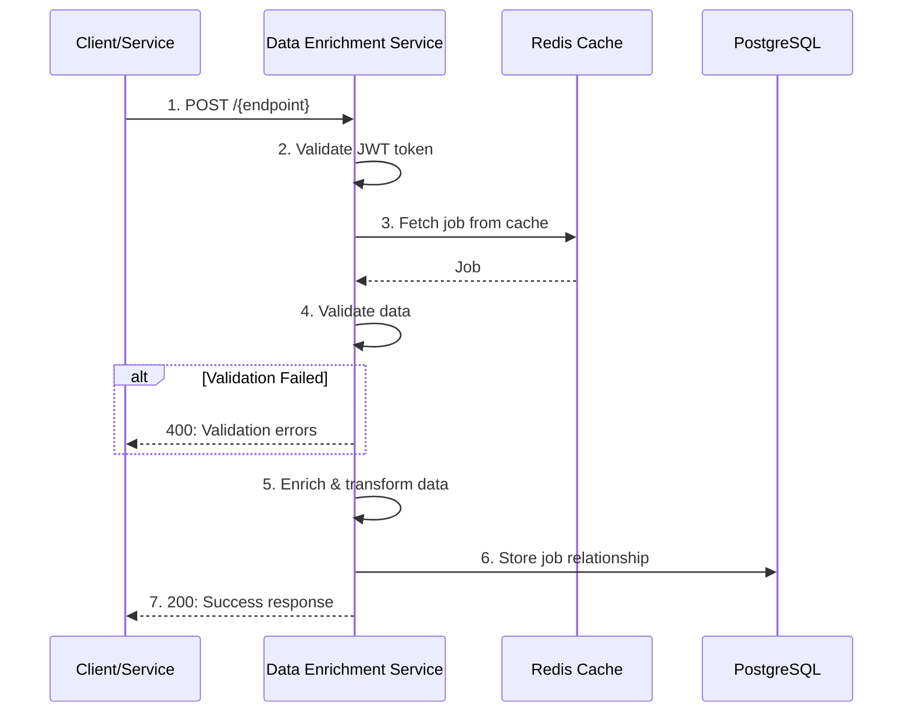
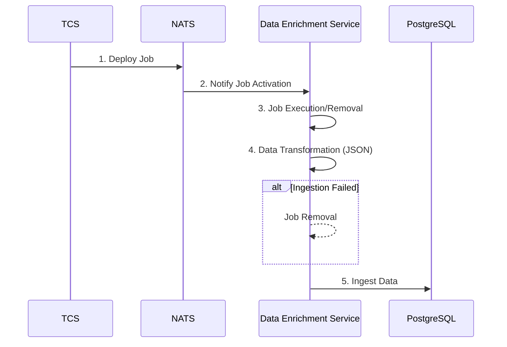

# Data Enrichment Service

## Overview

High-performance middleware service for the Tazama FRMS (Fraud Risk Management System) that receives, validates, and enriches data.

**Key Capabilities:**

- Validates incoming transactions using JSON Schema
- Enriches transaction data with additional context
- Routes processed events via NATS messaging
- Persists transaction relationships in PostgreSQL
- Provides Redis caching for improved performance
- Implements job queue processing for asynchronous tasks

### Setting Up

```sh
git clone https://github.com/tazama-lf/data-enrichment-service
cd data-enrichment-service
```

You then need to configure your environment: a [sample](.env.sample) configuration file has been provided and you may adapt that to your environment. Copy it to `.env` and modify as needed:

```sh
cp .env.sample .env
```

#### Prerequisites

- Node.js 20+
- PostgreSQL 15+
- Valkey 7+
- NATS Server 2.10+

#### Build and Start

```sh
npm install
docker-compose up -d redis nats postgres (do not worry if full-stack-docker is running)
npm run start:dev
```

The service will be available at `http://localhost:3001`

#### Project Variables

| Variable    | Purpose                 | Example       |
| ----------- | ----------------------- | ------------- |
| `APP_PORT`  | Port to serve on        | `3001`        |
| `NODE_ENV`  | Application environment | `development` |
| `LOG_LEVEL` | Logging verbosity       | `info`        |

#### Database Variables

| Variable            | Purpose           | Example     |
| ------------------- | ----------------- | ----------- |
| `DATABASE_HOST`     | PostgreSQL host   | `localhost` |
| `DATABASE_PORT`     | PostgreSQL port   | `5432`      |
| `DATABASE_NAME`     | Database name     | `tcs`       |
| `DATABASE_USER`     | Database user     | `postgres`  |
| `DATABASE_PASSWORD` | Database password | `postgres`  |

#### Cache Variables

| Variable         | Purpose                       | Example          |
| ---------------- | ----------------------------- | ---------------- |
| `REDIS_HOST`     | Redis host                    | `localhost`      |
| `REDIS_PORT`     | Redis port                    | `6379`           |
| `REDIS_PASSWORD` | Redis password                | `redis-password` |
| `CACHE_TTL`      | Cache time-to-live in seconds | `3600`           |

#### Messaging Variables

| Variable              | Purpose             | Example                 |
| --------------------- | ------------------- | ----------------------- |
| `NATS_URL`            | NATS server URL     | `nats://localhost:4222` |
| `NATS_CONSUMER_GROUP` | Consumer group name | `dems-consumer`         |

#### Authentication Variables

| Variable           | Purpose               | Example                 |
| ------------------ | --------------------- | ----------------------- |
| `JWT_SECRET`       | JWT signing secret    | `your-jwt-secret`       |
| `AUTH_SERVICE_URL` | Auth service endpoint | `http://localhost:3001` |

## API

### 1. Process Enrichment

#### Description

Validates, enriches, and processes data.

#### Request

- **Method:** POST
- **URL:** `/{endpoint}`
- **Headers:**
  - `Authorization: Bearer <jwt-token>`
  - `Content-Type: application/json`
- **Body:**

```json
{
  "body": {
    "Name": "xyz",
    "country": "country-1",
    "city": "city-1",
  }
}
```

#### Response

- **Status Code:** 200 OK
- **Content-Type:** application/json
- **Body:**

```json
{
  "message": "Data Enriched Successfully",
  "success": true
}
```

## Internal Process Flow

### Sequence Diagram for Push Job



### Sequence Diagram for Pull Job



## Testing

Run the test suite to validate functionality:

```sh
# Run all tests
npm run test

# Run tests with coverage
npm run test:cov

# Run tests in watch mode
npm run test:watch
```

For testing instructions, see `/docs/how to test dems.readme.md`

## Troubleshooting

### Service won't start

**Issue:** `npm install` fails
- Ensure Node.js 20+ is installed
- Check network access to npm registry

**Issue:** Database connection errors
- Verify PostgreSQL is running: `docker ps` or check service status
- Confirm credentials in `.env` match your database

**Issue:** Redis connection errors
- Check REDIS is running: `docker ps` or service status
- Verify `REDIS_HOST`, `REDIS_PORT`, and `REDIS_PASSWORD` in `.env`

**Issue:** NATS messaging failures
- Check NATS server is running: `docker ps` or service status
- Verify `NATS_URL` in `.env`

### Authentication Errors

- Verify JWT token is valid and not expired
- Check `JWT_SECRET` matches across services
- Ensure `AUTH_SERVICE_URL` is reachable
